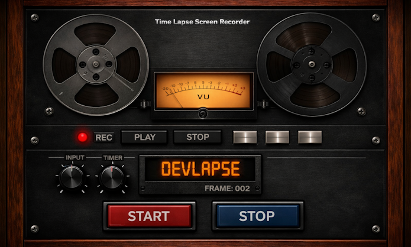
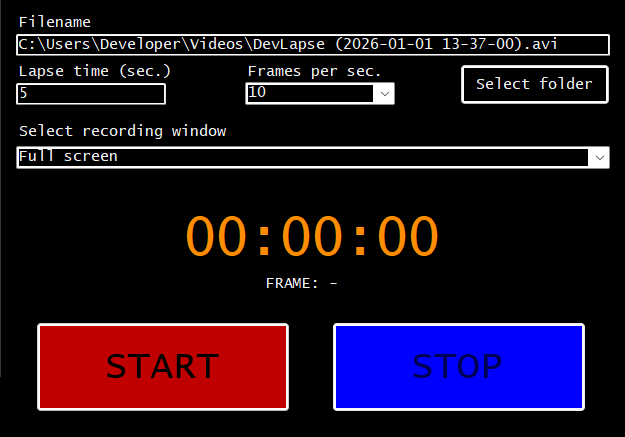
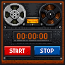

<p align="center">
 
</p>

# DevLapse - Time Lapse Screen Recorder

[](LICENSE) [](https://github.com/nikbergq/DevLapse/actions)


A lightweight Windows tool for creating timelapse recordings of your screen. Capture hours of work in seconds — without heavy recording software or massive file sizes.

**Capture the process, not just the result.**

## Why DevLapse?

Perfect for:
- Coding sessions and dev logs
- Speed-design videos (Figma, Blender, Photoshop)
- Digital art and illustration timelapses
- Game development and level building (Unity, Unreal)
- Documenting long-running processes or builds
- Sharing your creative workflow on YouTube, TikTok, or social media

## Screenshot




## Features

- Record full screen or a specific open window
- Window capture works even when the window is behind other windows
- Configurable capture interval in seconds
- Exports to AVI (Motion JPEG) — no external codec required
- Simple WinForms UI — just pick a window, set the interval, and hit Start

## Download

Get the latest version from the [Releases](https://github.com/nikbergq/DevLapse/releases) page.

## Getting started

<p align="left">
  
</p>

### Requirements

- Windows 10 or 11
- .NET 8.0 Runtime (or SDK to build from source)
- Visual Studio 2022 (to build from source)

### Build and run

1. Clone the repo:
   ```
   git clone https://github.com/nikbergq/DevLapse.git
   ```
2. Open `DevLapse.sln` in Visual Studio
3. Build and run (F5)

## Usage

1. Select a window from the dropdown, or leave it on "Full screen"
2. Set the capture interval (in seconds) — lower values = smoother timelapse, larger files
3. Set the output frame rate (1-60 fps)
4. Click **START** to begin recording
5. Click **STOP** to finish — the AVI file is saved to `%USERPROFILE%\Videos\DevLapse` or your selected folder

### Playback speed

Both the capture interval and the output frame rate are configurable, and together they determine playback speed: `speed-up = interval (seconds) × fps`. For example, a 1-second interval at 10 fps gives roughly 10x speed-up, a 5-second interval at 10 fps gives 50x, and a 60-second interval at 30 fps gives 1800x. Raise the fps for smoother playback at the same speed-up, or adjust the interval to change the speed-up directly.

## Known limitations

- **AVI file size:** AVI has a 2 GB file size limit, and Motion JPEG is not heavily compressed, so files can get large fast — especially at high resolutions or long capture interval × duration combinations. For longer sessions, use a higher interval or lower resolution. Auto-split is not yet implemented — pull requests welcome.
- **Window resizing:** If the recorded window is resized during capture, the output may be distorted since the video dimensions are set at the start of recording.
- **Unsigned binary:** Release builds are not code-signed. Windows SmartScreen or your antivirus may flag the download on first run — click "More info" → "Run anyway" in the SmartScreen prompt, or add an exclusion if your antivirus blocks it.

## Troubleshooting

- If recordings stop or AVI files are corrupt, try increasing the capture interval or lowering resolution.
- Ensure you have write permissions to `%USERPROFILE%\Videos\DevLapse`.
- DevLapse uses a built-in, codec-free Motion JPEG encoder, so no external codec installation is needed. If recordings still fail to play, try a different media player (e.g. VLC) to rule out player-side codec issues.

## Contributing

Pull requests are welcome! Please read [CONTRIBUTING.md](CONTRIBUTING.md) before submitting. Open issues for bugs or feature requests.

Suggested contributions:

- Auto-split output files to avoid the 2 GB AVI limit
- Additional output formats (MP4, GIF)
- Pause/resume functionality
- Configurable JPEG quality (currently hardcoded to 75)
- Live input validation for interval/fps fields

## Tech stack

- C# (.NET 8)
- WinForms
- SharpAvi

Testing is currently manual — automated tests planned.

## Third-party libraries

- [SharpAvi](https://github.com/baSSiLL/SharpAvi) by Vasili Maslov — AVI file writing. Licensed under the [MIT License](https://github.com/baSSiLL/SharpAvi/blob/master/LICENSE).

## License

This project is licensed under the MIT License — see the [LICENSE](LICENSE) file for details.
